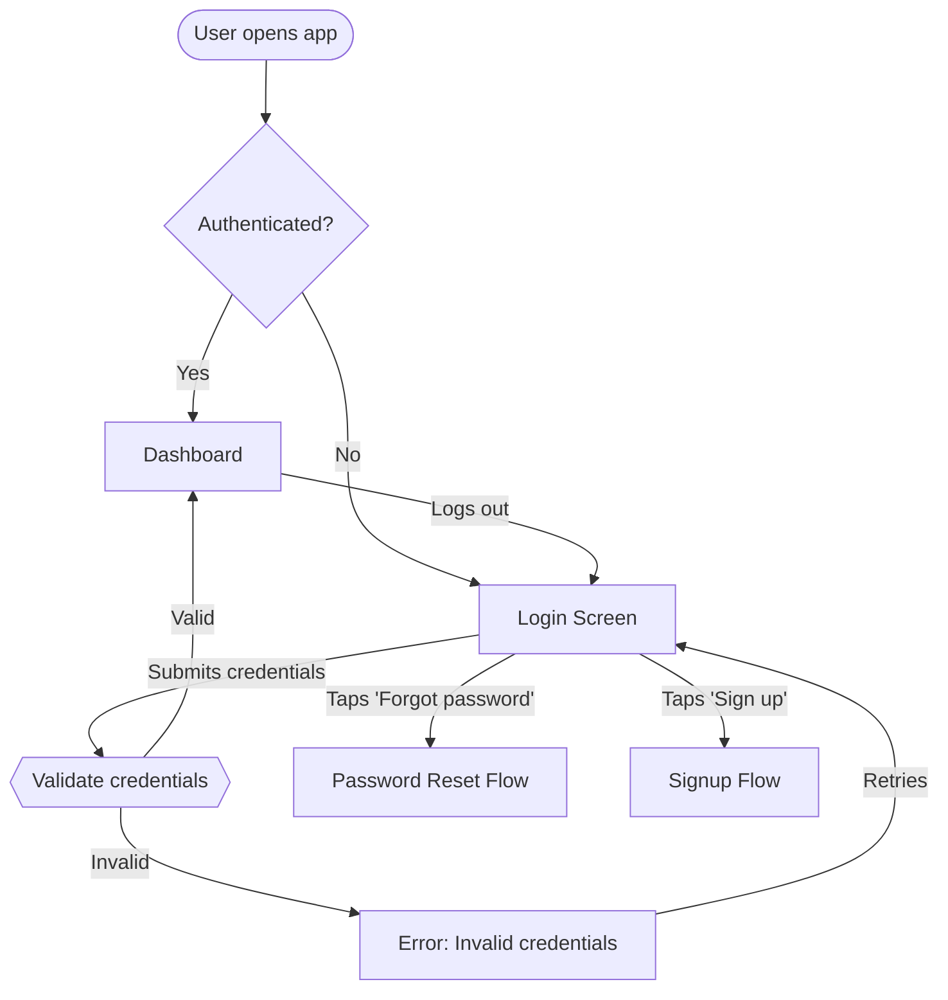

# User Flow Design

*Design — Step 2 of 2. Maps navigation paths, decision points, and screen-to-screen transitions into a validated flow diagram.*

**Core Question:** "Can the user complete their goal without thinking?"

## Inputs Required
- A product or feature requiring flow mapping (new feature, redesign, or existing flow audit)
- Target user role or persona (flows change per role)
- The user goal the flow serves (one goal per flow)

## Output
- `.agents/design/user-flow.md`

## Quality Gate
Before delivering, verify:
- [ ] Every decision point has ≥2 labeled exits (including the unhappy path)
- [ ] Error paths lead to recovery states — no dead ends
- [ ] Entry and exit points are explicit (not implied)
- [ ] Flow serves exactly one user goal — split if multiple goals emerged
- [ ] Empty, loading, and permission states are accounted for
- [ ] Back/cancel actions are defined at every step where the user might retreat

## Chain Position
Previous: `brand-system` (optional — provides design tokens and component context) | Next: handoff to implementation

**Re-run triggers:** When product features change significantly, when user research reveals new patterns, after usability testing reveals flow issues, or when adding new user roles.

**Related skills (non-chain):** `system-architecture` (consumes flow diagrams for API design), `task-breakdown` (uses flows for feature decomposition), `plan-interviewer` (generates specs that inform flows)

---

## Before Starting

### Step 0: Product Context
Check for `.agents/product-context.md`. If missing: **INTERVIEW.** Interview for product dimensions (what, who, problem, differentiator, constraints) and save to `.agents/product-context.md`. Or recommend running `icp-research (from hungv47/comms-skills)` to bootstrap it.

If `.agents/product-context.md` has a `date` field older than 30 days, recommend re-running `icp-research` to refresh it before proceeding.

### Required Artifacts
None — this skill can run standalone.

### Optional Artifacts
| Artifact | Source | Benefit |
|----------|--------|---------|
| `product-context.md` | icp-research (from hungv47/comms-skills) | Product and user context for better flow decisions |
| `.agents/design/brand-system.md` | brand-system | Component inventory and design tokens inform screen-level detail |

### Flow Interview
Interview for these dimensions before proceeding:

**Product context**
1. What product or feature needs flow mapping?
2. What problem does it solve for the user?
3. Who is the primary user? (role, technical skill, frequency of use)

**Flow scope**
4. What is the single user goal this flow serves?
5. Where does the flow start? (specific trigger: link click, app launch, notification tap)
6. What does success look like? (specific end state)
7. Are there existing flows to reference, replace, or extend?

**Constraints**
8. Platform — web, iOS, Android, cross-platform?
9. Authentication requirements? (logged in, guest, role-based)
10. Technical or business rules that force specific paths?

---

## Step 1: Assess Flow Complexity

Classify the flow to set structural expectations:

| Type | Pattern | When to use | Typical depth |
|------|---------|-------------|---------------|
| **Linear** | A → B → C → Done | Onboarding, tutorials, checkout | 3-8 screens |
| **Branching** | A → B or C based on condition | Personalization, role-based access | 5-15 screens |
| **Cyclical** | A → B → C → A (loop) | Dashboards, feeds, iterative editing | 4-10 screens per cycle |
| **Hub-and-spoke** | Hub → {A, B, C} → Hub | Settings, multi-feature navigation | 1 hub + 3-8 spokes |

For flows exceeding 15 screens, decompose into sub-flows — each sub-flow is its own diagram with labeled entry/exit connectors.

---

## Step 2: Map Flow Structure

Define all components before visualization:

### Entry points
List every way a user enters this flow (deep link, menu tap, redirect, notification). Each entry point becomes a start node.

### Core screens and states
For each screen, capture:
- **Screen name** — concrete label, not generic ("Payment Method Selection", not "Step 3")
- **Purpose** — what the user decides or accomplishes here
- **User actions** — every interactive element (tap, type, swipe, toggle)
- **System responses** — what happens after each action (API call, validation, animation)

### Decision points
For each branch:
- **Condition** — exact rule ("cart total > $50", "user.role === 'admin'")
- **Exits** — label every outgoing path, including the default/fallback
- **Who decides** — user choice vs. system logic vs. data-driven

### Edge cases
Account for these states at every screen where they apply:
- **Error** — validation failure, server error, timeout → recovery path
- **Empty** — no data, first use → onboarding or placeholder
- **Loading** — async operations → skeleton or spinner
- **Permission** — insufficient access → upgrade prompt or redirect
- **Offline** — no connectivity → cached state or retry

### Exit points
Label each exit:
- **Success** — goal achieved
- **Abandonment** — user leaves mid-flow (track where)
- **Error terminal** — unrecoverable failure (with support/retry option)
- **Redirect** — flow hands off to another flow

---

## Step 3: Create Flow Diagram

### Notation standards

Use Mermaid `graph TD` with these node shapes consistently:

| Shape | Meaning | Mermaid syntax |
|-------|---------|----------------|
| Rounded rectangle | Screen / page | `[Screen Name]` |
| Diamond | Decision point | `{Condition?}` |
| Stadium | Start / end | `([Start])` or `([End])` |
| Hexagon | System process | `{{Process}}` |
| Parallelogram | External input/output | `[/Input/]` |

### Label conventions
- Edge labels describe the trigger or condition: `-->|"Clicks Submit"|`
- Use present tense: "Enters email", not "User enters email"
- Decision exits use exact conditions: `-->|"Valid"|` and `-->|"Invalid"|`

### Diagram construction



### Annotations
Add annotations below the diagram for logic that does not fit in edge labels:

```
**Annotations:**
1. AuthCheck: Uses JWT token expiry. Tokens refresh silently if < 24h expired.
2. Validate: Rate-limited to 5 attempts/15min. After limit → CAPTCHA gate.
3. LoginError: Displays generic message — avoid revealing whether email exists.
```

### Sub-flow references
For complex flows, split into named sub-flows and link them:
```
→ [See: Signup Sub-flow] (entry: "Taps 'Sign up'" from Login)
→ [See: Password Reset Sub-flow] (entry: "Taps 'Forgot password'" from Login)
```

---

## Step 4: Validate

Run through these checks:

**Structural integrity**
- Trace every path from every entry point to an exit — no orphan screens
- Confirm every decision diamond has ≥2 labeled exits
- Verify no screen is unreachable

**Completeness**
- Error states exist for every action that can fail
- Back/cancel is available wherever the user might want to retreat
- Empty and loading states are noted where data is fetched

**Usability**
- Happy path is ≤7 steps from entry to success (Miller's threshold)
- No unnecessary decision points — if the system can decide, automate it
- Cognitive load per screen is manageable (≤3 primary actions)

**Handoff readiness**
- Screen names match what developers and designers will use
- Conditions on decision points are implementable (not vague)
- Async operations are identified (API calls, file uploads, payment processing)

Iterate with the user on any gaps found.

---

## Artifact Template

On re-run: rename existing artifact to `user-flow.v[N].md` and create new with incremented version.

```markdown
---
skill: user-flow
version: 1
date: {{today}}
status: draft
---

# User Flow: [Flow Name]

## Context
- **Product:** [product/feature]
- **User:** [role/persona]
- **Goal:** [single user goal]
- **Platform:** [web/iOS/Android/cross-platform]
- **Flow type:** [linear/branching/cyclical/hub-and-spoke]

## Flow Diagram

​```mermaid
graph TD
    [diagram here]
​```

**Annotations:**
1. [Node]: [implementation detail or business rule]

## Screen Inventory

| # | Screen | Purpose | Actions | Next States |
|---|--------|---------|---------|-------------|
| 1 | [name] | [why it exists] | [user actions] | [where each action leads] |

## Edge Cases Handled

| State | Screen(s) | Handling |
|-------|-----------|----------|
| Error | [screens] | [recovery path] |
| Empty | [screens] | [placeholder/onboarding] |
| Loading | [screens] | [skeleton/spinner] |
| Permission | [screens] | [upgrade/redirect] |

## Validation Summary

- Happy path length: [N steps]
- Decision points: [N total]
- Error recovery paths: [N total]
- Dead ends: 0

## Sub-flows

- [Sub-flow name] → see `user-flow-[name].md`

## Next Step

Hand off to implementation. Pair with `brand-system` for visual design tokens if not already created.
```

---

## Worked Example

**User:** "Map the checkout flow for our e-commerce app."

**Interview:**
- "What platform?" → "Mobile app, iOS and Android"
- "Who is the user?" → "Logged-in customer with items in cart"
- "Where does the flow start?" → "User taps 'Checkout' from cart"
- "What's the success state?" → "Order confirmed, confirmation screen shown"
- "Constraints?" → "Must support Apple Pay, credit card, and PayPal. Minimum order $10."

**Complexity assessment:** Branching flow — payment method selection creates 3 parallel paths.

**Artifact saved to `.agents/design/user-flow.md`:**

```markdown
# User Flow: Mobile Checkout

## Context
- **Product:** E-commerce mobile app
- **User:** Logged-in customer
- **Goal:** Complete purchase from cart
- **Platform:** iOS + Android
- **Flow type:** Branching

## Flow Diagram

​```mermaid
graph TD
    Start([Taps 'Checkout' from Cart])
    Start --> MinCheck{Cart ≥ $10?}
    MinCheck -->|"No"| MinError[Error: Minimum $10 required]
    MinError -->|"Returns to cart"| End1([Back to Cart])
    MinCheck -->|"Yes"| Address[Shipping Address]
    Address -->|"Confirms address"| Shipping[Shipping Method]
    Address -->|"Taps 'Cancel'"| End1
    Shipping -->|"Selects method"| Payment[Payment Selection]
    Payment -->|"Apple Pay"| ApplePay{{Apple Pay Sheet}}
    Payment -->|"Credit Card"| CardEntry[Card Entry Form]
    Payment -->|"PayPal"| PayPalRedirect{{PayPal Redirect}}
    ApplePay -->|"Authorized"| Review[Order Review]
    ApplePay -->|"Declined"| PayError[Payment Error]
    CardEntry -->|"Valid card"| Review
    CardEntry -->|"Invalid"| CardError[Validation Error]
    CardError -->|"Corrects"| CardEntry
    PayPalRedirect -->|"Approved"| Review
    PayPalRedirect -->|"Cancelled"| Payment
    PayError -->|"Tries again"| Payment
    Review -->|"Confirms order"| Processing{{Process Payment}}
    Processing -->|"Success"| Confirmation[Order Confirmation]
    Processing -->|"Failure"| PayError
    Confirmation --> End2([Done])
​```

**Annotations:**
1. MinCheck: Evaluated on cart subtotal before tax/shipping.
2. ApplePay: Uses Stripe Apple Pay SDK. Falls back to card entry if unavailable.
3. Processing: 3-second timeout → retry once, then show PayError.

## Screen Inventory

| # | Screen | Purpose | Actions | Next States |
|---|--------|---------|---------|-------------|
| 1 | Shipping Address | Confirm/edit delivery address | Confirm, Edit, Cancel | Shipping Method, Cart |
| 2 | Shipping Method | Select delivery speed | Select option | Payment Selection |
| 3 | Payment Selection | Choose payment method | Apple Pay, Card, PayPal | Respective payment flow |
| 4 | Card Entry Form | Enter card details | Submit, Back | Order Review, Validation Error |
| 5 | Order Review | Final confirmation | Confirm, Edit, Cancel | Processing, previous screens |
| 6 | Order Confirmation | Success state | View order, Continue shopping | Done |

## Edge Cases Handled

| State | Screen(s) | Handling |
|-------|-----------|----------|
| Error | Payment flows | Return to Payment Selection with message |
| Empty | Shipping Address | Pre-fill from profile, prompt if missing |
| Loading | Processing | Spinner with "Processing payment..." — disable back button |
| Permission | Apple Pay | Hide option if device doesn't support it |

## Validation Summary

- Happy path length: 5 steps (Address → Shipping → Payment → Review → Confirmation)
- Decision points: 3 (minimum check, payment method, payment result)
- Error recovery paths: 3 (minimum order, card validation, payment failure)
- Dead ends: 0
```

---

## References

- [references/research-checklist.md](references/research-checklist.md) — Pre-design research: user research methods, information architecture, content strategy
- [scripts/generate_flow.py](scripts/generate_flow.py) — Generate Mermaid diagrams programmatically for complex or multi-variant flows
